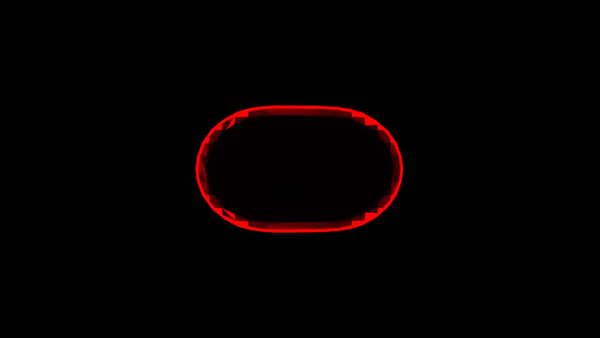

# Molecular Orbital Transitions (MOT)

Animate molecular orbital transitions using Psi4 and Blender

Author: Maximilian Paradiz Dominguez, University of Amsterdam

   LUMO)">

   LUMO">

This is a personal project still in the very early stages of development. 

Given a molecule, it will generate an animation depicting the wave function of an electron as it undergoes a Rabi cycle that moves the electron from one orbital into another.
This can be useful for obtaining a visual representation of a simple electronic excitation in which the first excited state is well described by a single configuration, such as a HOMO -> LUMO transition. 

This small program is meant to be an educational tool. It is written in a way that should allow you to adapt it to your particular needs. This program depends only on FOSS software. 

## Dependencies

[Python](https://www.python.org/) (Tested with  Python  3.9)

[Psi4](https://psicode.org/) (Tested with Psi4 1.5a1.dev151)

[Blender](https://www.blender.org/) (Tested with  Blender 2.93.5)

[FFmpeg](https://ffmpeg.org/) (Tested with ffmpeg n4.4.1)

### Python libraries:

[numpy](https://numpy.org/)

[scikit-image](https://scikit-image.org/docs/stable/api/skimage.html)

## Usage

Make sure that the dependencies are installed.

Set the MOT environmental variable to the path of the MOT folder which contains the scripts.

Use chmod +x animate.py and chmod +x setup_view.py to allow these scripts to be executed.

Running #MOT/animate.py will create an animation of the HOMO -> LUMO molecular orbital transition.

This set of scripts has been tested using the following setup:

